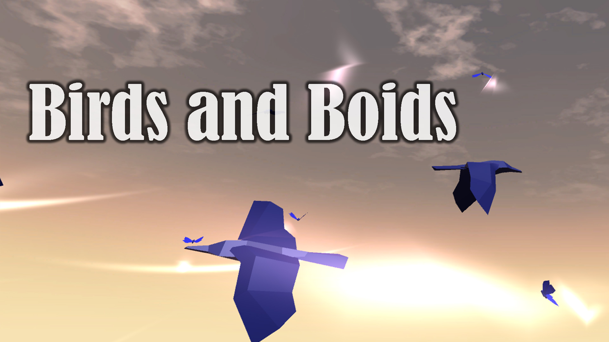

# Birds and Boids

Birds and Boids is a relaxing interactive experience that utilizes Leap Motion Hand-tracking in combination with Unity's 3D and sound engine features.

#### Developed in Unity 2019.2.2f1

# Contributors
- Diana Kumykova
- Linda Puzey
- Nina Taurich
- Mikel Matticoli

# Directory Structure
- `Assets/` - contains all custom assets
- `Acorn Bringer Assets/` - Nature model asset pack
- `Butterfly (animated)/` - Butterfly asset pack
- `Demo/` - Contains main scene and 3D Boids dependencies (adapted from  e-sarkis’ 3D boids [https://github.com/e-sarkis/Boids-AI](https://github.com/e-sarkis/Boids-AI)
- `LeapMotion/` - Leap Motion SDK Dependencies
- `WorldSkies/` - Skybox asset pack
